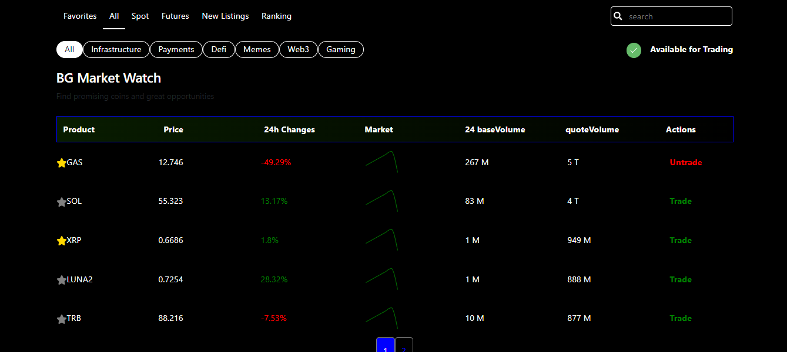
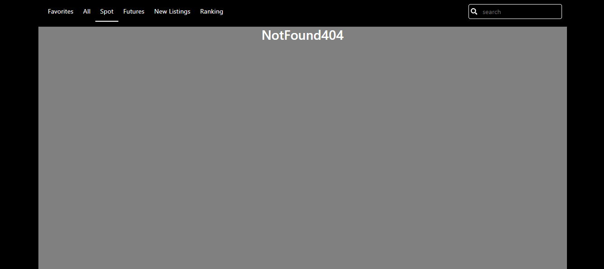
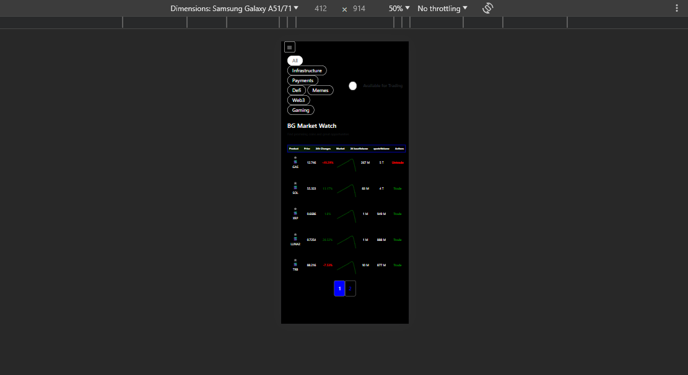
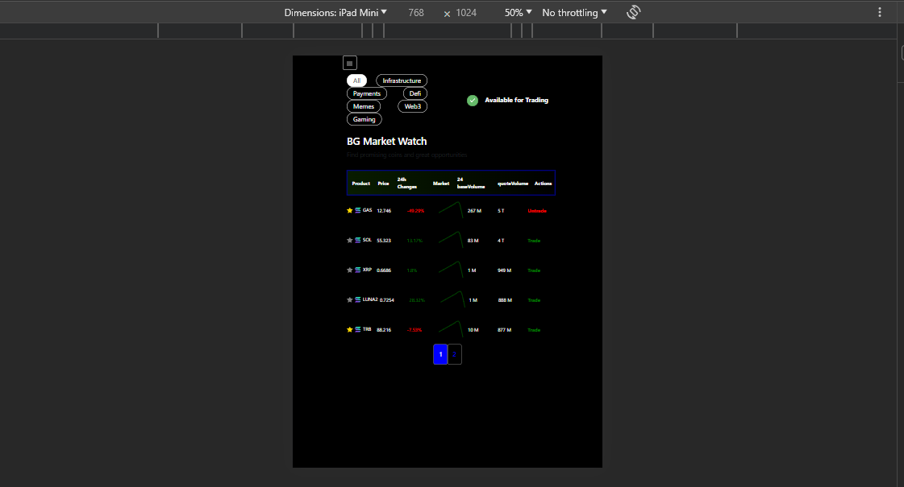
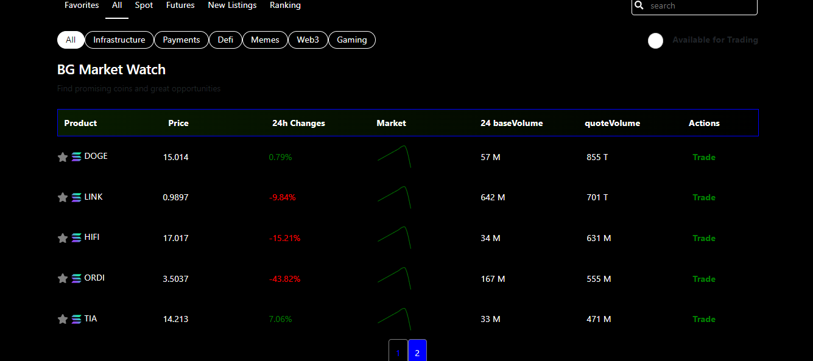
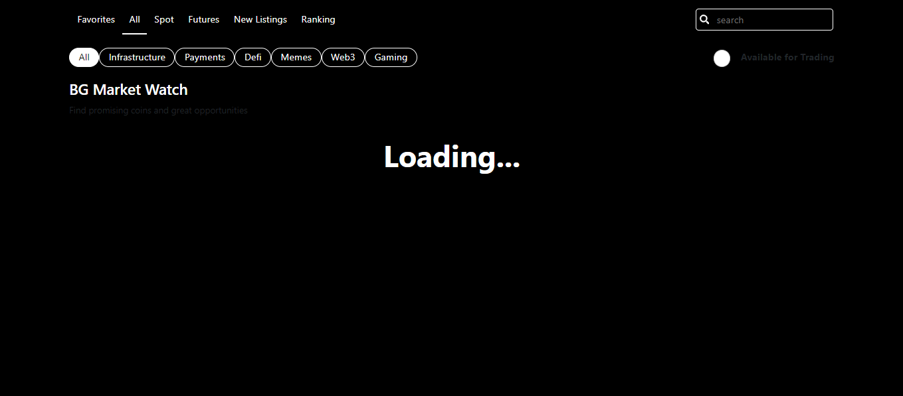

# project coin panel :

The digital currency panel project, which is React with the framework and has pagination and responsive features, and is also displayed as a loading page until the image of the cryptocurrency icon is received from API, and the whole project is in the form of (spa)

 

## this project make with:

## Demo:

